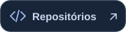
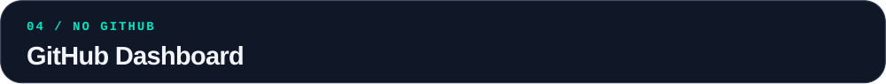
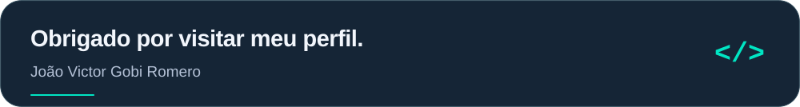

<!--
  Perfil: joaovromero/joaovromero
  Coloque este README.md e a pasta assets na raiz do repositório público.
  As imagens SVG contêm as animações. Não cole o SVG diretamente no Markdown.
-->

<picture>
  <source media="(max-width: 600px)" srcset="./assets/header-mobile.svg">
  
</picture>

  
  
  
  

<picture>
  <source media="(max-width: 600px)" srcset="./assets/profile-mobile.svg">
  
</picture>

 

<picture>
  <source media="(max-width: 600px)" srcset="./assets/tech-carousel-mobile.svg">
  
</picture>

 

<picture>
  <source media="(max-width: 600px)" srcset="./assets/studying-mobile.svg">
  
</picture>

  
Ver todos os temas de estudo

- Ciências da Computação
- Desenvolvimento Web
- Desenvolvimento FullStack
- Lógica e Fundamentos de Programação
- Boas Práticas de Desenvolvimento
- Novas Tecnologias

 

<picture>
  <source media="(max-width: 600px)" srcset="./assets/dashboard-heading-mobile.svg">
  
</picture>

<!-- Os cartões abaixo são gerados por um serviço externo e podem sofrer limites de uso. -->

  
  

  
  

 

<picture>
  <source media="(max-width: 600px)" srcset="./assets/footer-mobile.svg">
  
</picture>
