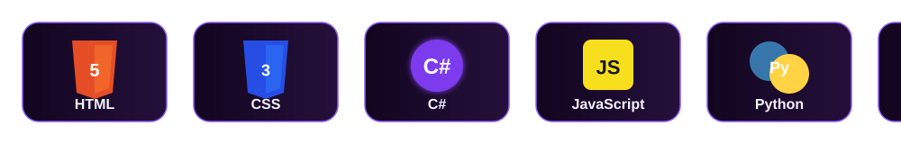

---

<table width="100%">
  <tr>
    <td width="58%" valign="top">

## 🥸 Perfil

Tenho **18 anos**, sou natural de **São Paulo** e atualmente curso **Ciências da Computação na UNICID**.

Sou apaixonado por tecnologia e busco desenvolver continuamente meus conhecimentos na área.

Tenho interesse em **desenvolvimento de software** e procuro ampliar minhas habilidades por meio de estudos e novos projetos.

  </td>
    <td width="42%" valign="top">

## 🌐 Conecte-se comigo

  

  

  </td>
  </tr>
</table>

---

## 💻 Linguagens & Tecnologias

---

## 🚀 Atualmente estudando

---

## 📊 GitHub Dashboard

---

## 📈 Atividade

---

## 🐍 Contribuições

---

## 🏆 GitHub Trophies

---

